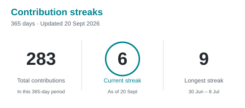
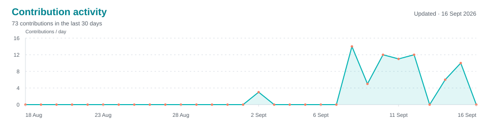

<div align="center">

<a href="https://pljf.github.io/">
  <picture>
    <source media="(max-width: 600px) and (prefers-color-scheme: dark)" srcset="assets/intro-mobile-dark.svg">
    <source media="(max-width: 600px) and (prefers-color-scheme: light)" srcset="assets/intro-mobile-light.svg">
    <source media="(prefers-color-scheme: dark)" srcset="assets/intro-dark.svg">
    
  </picture>
</a>

</div>

---

## 👨‍💻 About Me

Hey, I'm Patrick! I study **Computer Science and Mathematics** at Hunter College in **New York City**.

I'm drawn to coding because it lets me turn an idea into something useful. I like the mix of logic and creativity: breaking a problem down, trying an approach, and seeing it work.

---

## 🔭 What I'm Working On

| Project | What it is | Built with |
| :--- | :--- | :--- |
| ⚖️ **[CaseCraft](https://pljf.github.io/projects.html#casecraft)** | A legal reasoning platform for law students — create live transcripts, choose prosecution or defense roles, and generate structured, AI-assisted arguments | `Node.js` `Express` `MongoDB` `Groq` `OpenAI` |
| 🍽️ **[TableSync](https://pljf.github.io/projects.html#tablesync)** | Collaborative meal planning — share dietary preferences, vote on menus, and coordinate grocery shopping across group gatherings | `Next.js` `React` `TypeScript` `PostgreSQL` |

---

## 💼 Experience

### **Jasco Philanthropies** · _Investment and Finance Intern_

📍 New York, NY &nbsp;|&nbsp; 🗓️ July 2025

- Built briefs on NVDA and AAPL covering investment drivers, risks, and catalysts for limited partner updates.
- Created charts and summaries to support portfolio reviews and investment conversations.
- Surfaced opportunities from portfolio reviews with clearly framed upside and key metrics.

---

## 🧠 Skill Set

<div align="center">

**Languages**

<p>
  <a href="https://isocpp.org/" target="_blank"></a>
  <a href="https://www.python.org/" target="_blank"></a>
  <a href="https://www.javascript.com/" target="_blank"></a>
  <a href="https://www.typescriptlang.org/" target="_blank"></a>
  <a href="https://developer.mozilla.org/en-US/docs/Web/HTML" target="_blank"></a>
  <a href="https://developer.mozilla.org/en-US/docs/Web/CSS" target="_blank"></a>
</p>

**Frameworks &amp; Libraries**

<p>
  <a href="https://react.dev/" target="_blank"></a>
  <a href="https://nextjs.org/" target="_blank"></a>
  <a href="https://expressjs.com/" target="_blank"></a>
  <a href="https://fastapi.tiangolo.com/" target="_blank"></a>
  <a href="https://flask.palletsprojects.com/" target="_blank"><picture><source media="(prefers-color-scheme: dark)" srcset="https://cdn.simpleicons.org/flask/FFFFFF"></picture></a>
  <a href="https://www.djangoproject.com/" target="_blank"><picture><source media="(prefers-color-scheme: dark)" srcset="https://cdn.simpleicons.org/django/44B78B"></picture></a>
</p>

**Databases**

<p>
  <a href="https://www.postgresql.org/" target="_blank"></a>
  <a href="https://www.mongodb.com/" target="_blank"></a>
</p>

**Tools &amp; Testing**

<p>
  <a href="https://nodejs.org/" target="_blank"></a>
  <a href="https://www.prisma.io/" target="_blank"></a>
  <a href="https://www.docker.com/" target="_blank"></a>
  <a href="https://vitest.dev/" target="_blank"></a>
  <a href="https://playwright.dev/" target="_blank"></a>
</p>

</div>

---

## 📊 Stats &amp; Contributions

<p align="center">
  <picture>
    <source media="(prefers-color-scheme: dark)" srcset="assets/reference-contributions-dark.svg">
    <source media="(prefers-color-scheme: light)" srcset="assets/reference-contributions-light.svg">
    
  </picture>
</p>

<p align="center">
  <picture>
    <source media="(prefers-color-scheme: dark)" srcset="assets/reference-streak-dark.svg">
    <source media="(prefers-color-scheme: light)" srcset="assets/reference-streak-light.svg">
    
  </picture>
</p>

<p align="center">
  <picture>
    <source media="(prefers-color-scheme: dark)" srcset="assets/reference-activity-dark.svg">
    <source media="(prefers-color-scheme: light)" srcset="assets/reference-activity-light.svg">
    
  </picture>
</p>

<!--START_SECTION:profile-updated-->
<p align="center"><sub>Updated daily from GitHub · Last refreshed 2026-09-17 12:37 UTC</sub></p>
<!--END_SECTION:profile-updated-->

---

## ⏰ Coding Habits

<!--START_SECTION:coding-rhythm-->
**🦉 My Coding Rhythm**

```text
🌞 Morning            24 commits     ██████░░░░░░░░░░░░░░  30.8%
🌆 Daytime            19 commits     █████░░░░░░░░░░░░░░░  24.4%
🌃 Evening            35 commits     █████████░░░░░░░░░░░  44.9%
🌙 Night              0 commits      ░░░░░░░░░░░░░░░░░░░░   0.0%
```
<!--END_SECTION:coding-rhythm-->

---

<div align="center">

### 📫 Connect with Me

<a href="mailto:patrick.jf.luo@gmail.com"></a>
<a href="https://www.linkedin.com/in/patrick-luo-540394292/"></a>
<a href="https://github.com/pljf"></a>
<a href="https://pljf.github.io/"></a>

<sub>Always happy to talk about full-stack development, AI, mathematics, and finance research.</sub>

</div>
